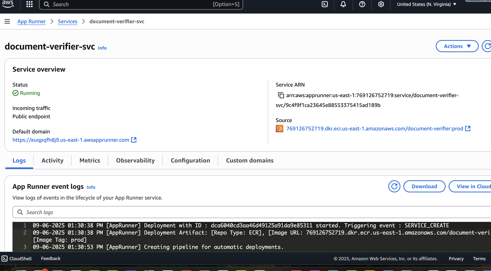
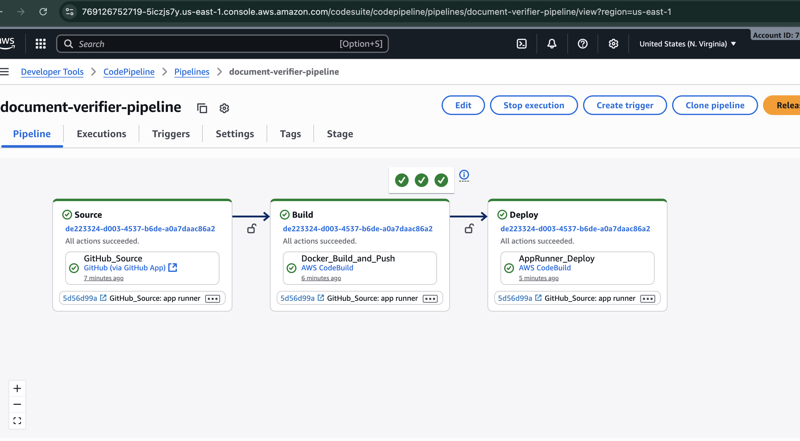

# Document Verifier API - Cloud Native Deployment (App Runner + CloudFront + ECR + CodePipeline)

Document Verification Service built with FastAPI, deployed on AWS App Runner with infrastructure managed via Terraform. Automated CI/CD using AWS CodePipeline ensures secure, scalable, and reliable deployments, with AWS Secrets Manager for configuration management.

This repository contains an API service packaged as a Docker container and deployed to AWS using:
- App Runner for container hosting
- Amazon ECR for container images
- AWS CodePipeline/CodeBuild for CI/CD
- Amazon CloudFront as a global edge and TLS terminator
- AWS WAF for basic L7 protection
- Route 53 for DNS
- AWS Secrets Manager for sensitive configuration (for example, VERIFICATION_API_KEY)

The default container port is 8000. Production images are identified by the ECR tag `prod`, and App Runner automatically deploys when the `prod` tag changes.

Region: `us-east-1`

---

## Architecture


---

## Components

- Application container
  - Dockerfile at `app/Dockerfile`
  - Listens on `0.0.0.0:${PORT:-8000}`
- Image registry: Amazon ECR repository `document-verifier` (manual or Terraform-managed; this guide assumes manual)
- Compute: AWS App Runner service `document-verifier-svc`
- CI/CD: CodePipeline + CodeBuild
  - Build pushes image tags `<short-sha>` and `prod`
  - App Runner auto-deploys on `:prod`tag & will updates
- Edge + TLS: CloudFront with ACM certificate in us-east-1
- DNS: Route 53 A to CloudFront
- Security:
  - AWS WAF
  - Secrets Manager for Variables for example; `VERIFICATION_API_KEY`
  - IAM roles for App Runner access to ECR and Secrets

---

## Prerequisites

- AWS account with admin or appropriate permissions
- AWS CLI v2 authenticated to your target account
- Terraform v1.6+ (recommended)
- Docker with Buildx enabled
- GitHub repository connected to CodePipeline
- ECR repository created manually: `document-verifier` (or change the name consistently)
- Secrets_manager ARN Required for the varibales
- Certificate_Manager ARN Required on your AWS Account
- Domain_Name Required for example example.com

Environment defaults used below:
- Account ID: detect automatically
- Region: `us-east-1`
- ECR repo name: `document-verifier`
- App port: `8000`

---

## Local Development

Build and run locally:

```bash
docker build -t document-verifier:local -f app/Dockerfile .
docker run --rm -p 8000:8000 \
  -e PORT=8000 \
  -e VERIFICATION_API_KEY=your-test-key \
  document-verifier:local

# Test
curl -i http://localhost:8000/
```

Make sure your app binds `0.0.0.0` and respects `PORT`:
- Example Uvicorn command: `uvicorn main:app --host 0.0.0.0 --port ${PORT:-8000}`

---

## Configuration

### Runtime environment variables Required to Application

- PORT (non-secret) default: 8000
- LOG_LEVEL (non-secret) default: info
- VERIFICATION_API_KEY (secret) required by the API for upstream verification

### Secrets

Create or update a secret in AWS Secrets Manager (string value, not JSON), then wire the ARN to Terraform. You can create it manually on console as well.

```bash
export AWS_DEFAULT_REGION="us-east-1"

aws secretsmanager create-secret \
  --name document-verifier-api-sm \
  --secret-string 'your-real-api-key' \
  || aws secretsmanager put-secret-value \
       --secret-id document-verifier-api-sm \
       --secret-string 'your-real-api-key'

# Capture its ARN for Terraform Run
export TF_VAR_verification_api_key_secret_arn=$(
  aws secretsmanager describe-secret \
    --secret-id document-verifier-api-sm \
    --query 'ARN' --output text
)
echo "$TF_VAR_verification_api_key_secret_arn"
```

Terraform maps this secret to the container env var `VERIFICATION_API_KEY`.

---

## One-time ECR Bootstrap (required)

App Runner needs a valid image at `ECR:prod` before it can start. Publish a small bootstrap image once.

```bash
# Set region and resolve ECR repo URI
export AWS_DEFAULT_REGION="us-east-1"
ACCOUNT_ID=$(aws sts get-caller-identity --query Account --output text)
ECR_REPO_NAME="document-verifier"
REPO_URI=$(aws ecr describe-repositories \
  --repository-names "$ECR_REPO_NAME" \
  --query 'repositories[0].repositoryUri' \
  --output text)
echo "REPO_URI=${REPO_URI}"

# Login to ECR
aws ecr get-login-password --region "$AWS_DEFAULT_REGION" \
  | docker login --username AWS --password-stdin \
    "${ACCOUNT_ID}.dkr.ecr.${AWS_DEFAULT_REGION}.amazonaws.com"

# Create a minimal amd64 image that serves on port 8000
cat > /tmp/Dockerfile.bootstrap <<'EOF'
FROM --platform=$TARGETPLATFORM python:3.12-slim
ARG TARGETPLATFORM
EXPOSE 8000
CMD ["python", "-m", "http.server", "8000"]
EOF

# Build and push explicitly for linux/amd64 to avoid "exec format error"
docker buildx version >/dev/null 2>&1 || docker buildx create --use --name amd64builder
docker buildx use amd64builder
docker buildx build \
  --platform linux/amd64 \
  -t "${REPO_URI}:prod" \
  -f /tmp/Dockerfile.bootstrap \
  --push \
  .
```

---

## Terraform Deployment

Export your variables:

```bash
export AWS_DEFAULT_REGION="us-east-1"
export TF_VAR_project_name="paynest-document-verifier"
export TF_VAR_github_owner="faran151"
export TF_VAR_github_repo="paynest-document-verifier-api"
export TF_VAR_cloudfront_acm_certificate_arn="put-your-CM-arn-here"
export TF_VAR_verification_api_key_secret_arn="put-your-secret-arn-here"
export TF_VAR_ecr_repository_name="document-verifier"
export TF_VAR_extra_runtime_environment_variables='{"PORT":"8000","LOG_LEVEL":"info"}'
```

Apply:

```bash
cd infrastructure
terraform init -upgrade
terraform plan
terraform apply -auto-approve
```

Useful outputs:

```bash
Cloudfront Domain-Name
Route53 Record
AppRunner Service URL
```

---

## CI/CD

- Build stage:
  - Builds on x86_64 and pushes two tags: `<short-sha>` and `prod`
  - If using Docker Buildx, ensure `--platform linux/amd64`
- Deploy stage:
  - App Runner auto-deploys when `:prod` changes.

Trigger a build:

```bash
aws codepipeline list-pipelines --query 'pipelines[].name' --output text
PIPELINE_NAME="paynest-document-verifier-api"
aws codepipeline start-pipeline-execution --name "$PIPELINE_NAME"
```

---

## Verifying the Deployment

Hit The URL and check the status of APi or CURL
    https://project-name-api.example.com

Tail logs:

```bash
aws logs describe-log-groups --log-group-name-prefix "/aws/apprunner" \
  --query 'logGroups[?contains(logGroupName, `paynest-document-verifier-svc`)].logGroupName' --output text

# Replace <LOG_GROUP> with the application log group name
aws logs tail "<LOG_GROUP>" --since 1h --follow
```

---

## Security

- IAM
  - App Runner access role: can read from ECR (GetAuthorizationToken, BatchGetImage, etc.)
  - App Runner instance role: can read specified Secrets Manager secrets and decrypt via KMS
  - Principle of least privilege applied; avoid wildcards where possible
- Secrets
  - Store `VERIFICATION_API_KEY` as a plain string in Secrets Manager
  - Encrypted at rest with AWS-managed KMS key (or BYOK if desired)
  - Exposed to the container as an environment secret only at runtime
- Supply chain
  - Build on x86_64 to match App Runner (linux/amd64)
  - Optionally enable ECR image scanning and enforce minimum severity policies
- Network and edge
  - CloudFront enforces HTTPS with ACM cert
  - WAF rules to block common attacks (SQLi, XSS, IP rate limit)
- Observability
  - App Runner streams logs to CloudWatch
  - Consider alarms on 5xx rates and latency

---

## How It Works

1. You push code to GitHub.
2. CodePipeline triggers CodeBuild, which builds a Docker image and pushes to ECR with tags `<short-sha>` and `prod`.
3. App Runner is configured to pull from your ECR repo and auto-deploy on `:prod` tag updates.
4. App Runner runs the container on port `8000` and fetches `VERIFICATION_API_KEY` from Secrets Manager at runtime.
5. CloudFront fronts the App Runner URL, providing global edge distribution and TLS (ACM) with WAF protections.
6. Route 53 points your custom domain to CloudFront.

---

## Clean Up

Orderly teardown to avoid dependency errors:

```bash
# Stop pipeline triggers or disable auto-deploy if desired
terraform destroy -auto-approve
# Manually delete ECR images and repository if it is managed outside Terraform & other resource as well
Delete AWS ECR Repositry -
Delete Certificate Manager -
Delete Secret Manager -
Delete Hosted Zone -
```
---